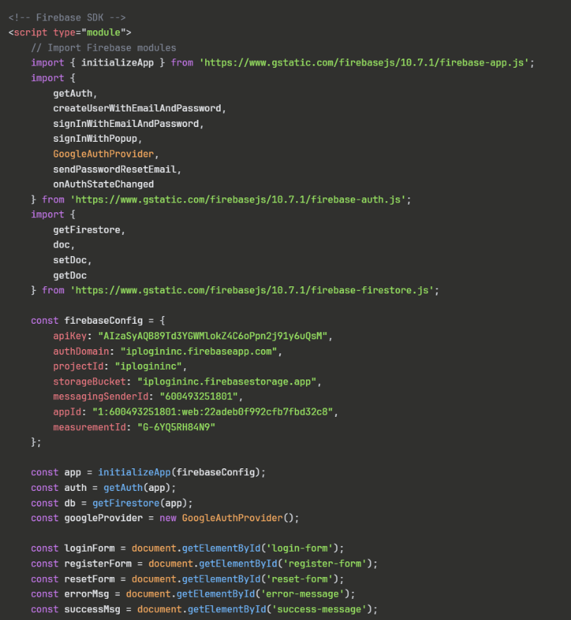
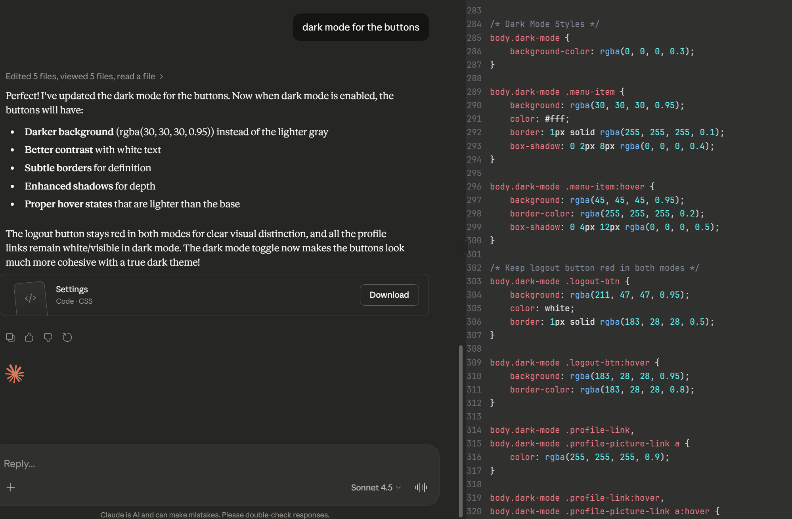

# INCubation
**Medical Diagnosis Game by MsytVale**

## Project Overview

INCubation is a story-driven medical diagnosis game set in the future. Humanity has been affected by two dangerous viruses known as Phantom and Vandal. Players act as a young doctor managing a clinic and must diagnose patients by observing symptoms, checking temperature, and identifying the correct virus stage.

Every decision affects the outcome. Correct diagnoses save patients and reward the player with credits and experience points, while mistakes lead to worsening conditions. The game combines narrative storytelling with problem-solving gameplay to create an engaging and meaningful experience.

## Design Process

### Target Audience

INCubation is designed for:
- Casual players who enjoy story-based games
- Players interested in simulation or decision-making games
- Visual novel fans
- Mobile and desktop users

### User Goals

Players should be able to:
- Follow an interesting story
- Diagnose patients using logic and observation
- Track their progress and performance
- Replay chapters for better results
- Play smoothly on different devices

### How the Design Supports These Goals

- A chapter-based story structure keeps the game organized
- The diagnosis system encourages careful thinking
- Rewards (credits and XP) motivate continued play
- Responsive layouts ensure usability on mobile and desktop
- Side panels provide helpful information without disruption

### User Stories

**As a new player, I want to:**
- Create an account easily so that my progress can be saved
- Understand the game interface quickly
- Access reference information when diagnosing patients

**As a returning player, I want to:**
- Continue my progress on any device
- View my stats and rewards
- Replay chapters to improve my results

**As a mobile user, I want to:**
- Play comfortably on a small screen
- Use touch-friendly controls
- Experience smooth navigation

**As a competitive player, I want to:**
- Compare my performance with others
- Earn rewards through good decisions

### Design Artifacts

*API login*

*Resize the logo*

*Dark mode buttons*

UI designed with a clean medical theme and dark atmosphere. Responsive structure planned for multiple screen sizes.

## Features

### Existing Features

**Authentication System**
- Allows users to register, log in, and securely access their saved data.

**Diagnosis Gameplay**
- Players analyze symptoms and temperature to identify the correct virus and stage.

**Story Chapters**
- Game progression is structured into chapters with different patients.

**Leaderboard**
- Random user profile generated to show different users each time when viewing the leaderboard
- Displays player rankings and statistics

**Rewards System**
- Players earn credits and experience points for correct diagnoses

**Encyclopedia & Checklist**
- Provides helpful information during gameplay

**Save & Settings System**
- Allows progress saving and user preferences

**Responsive Design**
- The game interface adapts to desktop, tablet, and mobile screens

### Features Left to Implement

- Additional story chapters
- More diagnosis tools or mini-games
- Expanded content and challenges
- Optional offline functionality (limited gameplay)

## Technologies Used

- **HTML** – Page structure and layout
- **CSS** – Styling and responsive design
- **JavaScript** – Game logic and interactions
- **[Firebase Authentication](https://firebase.google.com/products/auth)** – User login and account management
- **[Firebase Firestore](https://firebase.google.com/products/firestore)** – Data storage for progress and leaderboard
- **[Figma](https://www.figma.com)** – High and low fidelity wireframes
- **[Pinterest](https://pinterest.com)** – Background images
- **[Picrew](https://picrew.me)** – Character design
- **[Pixabay](https://pixabay.com)** – Audio files
- **Git & GitHub** – Version control and repository management
- **Adobe Illustrator** – Logo & branding designs

### Assistive AI

- **Claude AI** – Helped with API login function

## Testing

Manual testing was performed based on user actions:

### Collectibles Page – Manual Testing

This page allows users to:
- View their current credit balance
- View unlocked and locked badges
- Purchase official merchandise using credits
- Navigate to view all collectibles

#### 1. Credit Display Testing

**Scenario: Credit balance is displayed correctly**

1. Go to the Collectibles page
2. Verify that the credit balance (e.g. "195 CR") is displayed at the top right
3. Refresh the page
4. Verify that the balance remains consistent
5. If a purchase is made, verify that the credit amount updates correctly

**Expected Result:**
- Credit balance is visible at all times
- Balance updates immediately after purchase
- Credits never display negative values

#### 2. Badge Collection Section

**Scenario: Display unlocked and locked badges correctly**

1. Go to the Badge Collection section
2. Verify that unlocked badges (e.g. characters marked "seen") display:
   - Profile image
   - Character name
   - Status text
3. Verify that locked badges:
   - Display a lock icon
   - Are visually dimmed or disabled

**Expected Result:**
- Unlocked badges look visually different from locked badges
- Locked badges cannot be purchased (will pop out an error message for the users)
- The "View All" button navigates correctly to the full badge page

#### 3. Official Merchandise Section

**Scenario: Display purchasable items**

1. Scroll to the Official Merchandise section
2. Verify each item:
   - Displays an image
   - Has proper spacing and styling
   - Shows lock icon if not yet unlocked
   - Shows purchasable state if available

**Scenario: Purchase with sufficient credits**

1. Ensure user has enough credits
2. Click on a purchasable item
3. Confirm purchase
4. Verify:
   - Credits are deducted correctly
   - Item changes to unlocked/purchased state

**Expected Result:**
- Correct credit deduction

**Scenario: Attempt purchase with insufficient credits**

1. Reduce credits below required amount
2. Attempt to purchase an item
3. Verify:
   - Purchase is blocked
   - Error message appears (e.g. "Not enough credits")
   - Credits remain unchanged

#### 4. Navigation Testing

**Scenario: Back button works correctly**
1. Click the back arrow at the top left
2. Verify that it navigates correctly to the previous page

**Scenario: View All button works**
1. Click the "View All →" button
2. Verify correct page loads

#### 5. Responsive Design Testing

- Horizontal scroll in Badge Collection works properly
- Cards align correctly
- No overlapping text or images

#### 6. Accessibility Testing

- Checked color contrast between text and green background
- Verified that buttons are keyboard navigable
- Tested tab order sequence
- Verified alt text is present for product images

#### 7. Bugs / Issues Discovered

- Horizontal scroll bar appears slightly misaligned on smaller screens
- Long product names may overflow if not wrapped
- Locked items still show hover effect
- No confirmation modal before purchase

## Credits

### Media

- Photos obtained from [Pinterest](https://pinterest.com) and [Picrew](https://picrew.me)
- Audio from [Pixabay](https://pixabay.com)

### Acknowledgements

I received inspiration for this project from:
- ReStory: Chill Electronics Repairs
- Papers Please

## Contributors

### Sarah (API developer)
- Connect credits and XP throughout the whole website
- Finished the settings, support page
- Finished the main gameplay
- Login API
- Finished the login page
- Did the lottie animation
- Added music background
- Added checklist function

### Jerry (Front-end developer)
- Finished the home page
- Leaderboard API
- Added random user generator
- Finished the leaderboard page
- Finished the collectibles page

## Repository

GitHub: [https://github.com/j3rryng/IP-incubation](https://github.com/j3rryng/IP-incubation)